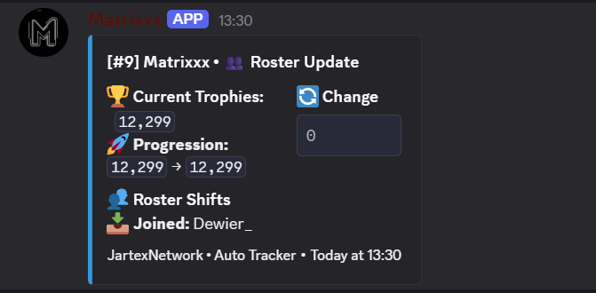
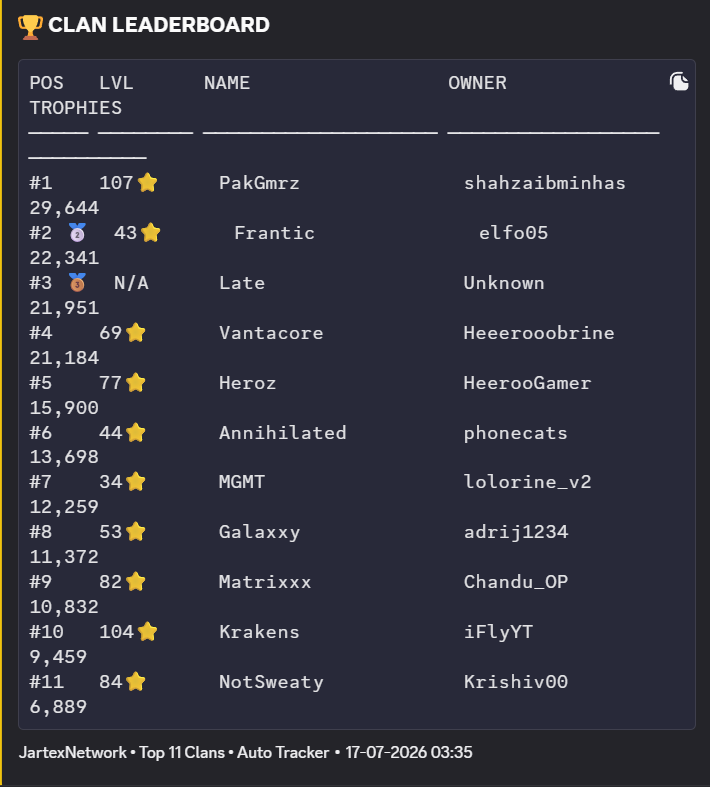
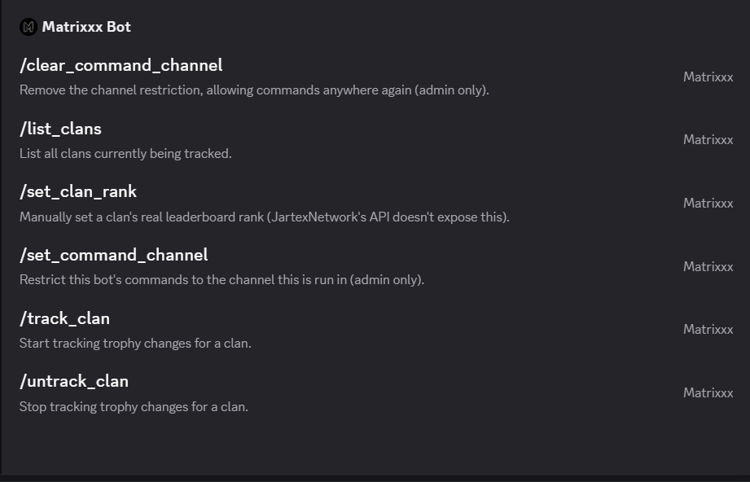

# JartexNetwork Clan Trophy Tracker

A Discord bot that watches trophy and roster changes across multiple JartexNetwork Minecraft clans and posts live updates, daily recaps, and a leaderboard to Discord — built to work around a public game API that never exposes the one number everyone actually wants: **rank**.

## What it does

- Polls JartexNetwork's stats API every minute for each tracked clan's trophy count, level, and member roster
- Posts a rich embed the moment trophies change (gain/loss) or someone joins/leaves
- Posts a daily recap per clan at midnight UTC — trophy delta, level change, and net roster movement for the day
- Supports tracking multiple clans at once, each routable to its own Discord channel
- Resolves a "leaderboard rank" for each clan even though the source API has no such field — see [The rank problem](#the-rank-problem-and-how-it-was-solved) below
- Persists everything in SQLite, so state survives restarts

## Screenshots

**Live trophy/roster update** — posted the moment a tracked clan's trophies or roster change:



**`/clan_leaderboard`** — trophy-sorted leaderboard across every tracked clan:



**Slash commands** — full admin/tracking command set, as seen in Discord:



## Tech stack

- Python 3, [discord.py](https://discordpy.readthedocs.io/) (`app_commands` slash commands, `discord.ext.tasks` for the polling/recap loops)
- `aiohttp` for async HTTP calls to the JartexNetwork API
- SQLite (`sqlite3`, stdlib) for persistence — no external DB server required
- `python-dotenv` for configuration

## Commands

| Command | Description |
|---|---|
| `/track_clan <name> [channel]` | Start tracking a clan. Optionally route its updates to a specific channel. |
| `/untrack_clan <name>` | Stop tracking a clan. |
| `/list_clans` | List every clan currently tracked and where its updates go. |
| `/clan_leaderboard` | Post a trophy-sorted leaderboard of every clan the bot knows about. |
| `/set_clan_rank <name> <rank>` | Manually pin a clan's real rank (and freeze it there). |
| `/freeze_clan_rank <name>` | Lock in whatever rank is currently showing, so it stops changing. |
| `/unfreeze_clan_rank <name>` | Release a frozen rank, returning it to live auto-computed tracking. |
| `/set_command_channel` / `/clear_command_channel` | Restrict (or unrestrict) which channel commands can be run in. Admin only. |

## Setup

```bash
git clone <your-repo-url>
cd jartex-clan-bot
pip install -r requirements.txt
cp .env.example .env   # then fill in the values below
python bot.py
```

### Configuration (`.env`)

| Variable | Required | Description |
|---|---|---|
| `DISCORD_TOKEN` | Yes | Your bot's token from the Discord Developer Portal. |
| `ANNOUNCE_CHANNEL_ID` | No | Fallback channel ID for clans tracked without a specific channel. |
| `DB_PATH` | No | SQLite file path (defaults to `clan_trophies.db`). |
| `ALLOWED_GUILD_IDS` | No | Comma-separated server IDs the bot is allowed to stay in — it auto-leaves anything else. |
| `BOT_OWNER_IDS` | No | Comma-separated user IDs allowed to change channel restrictions. |
| `CLAN_NAMES` | No | Comma-separated clan names to seed on first run. |

## Architecture

```
poll_trophies()  ──every 1 min──▶  fetch_clan_data()  ──▶  JartexNetwork API
      │                                                       │
      ▼                                                       ▼
_handle_clan_result()  ◀── diff against last-known state (SQLite)
      │
      ▼
 Discord embed (trophy change / roster shift) posted to the clan's channel

daily_recap_loop()  ──once/day (UTC midnight)──▶  same diff logic against
                                                    a rolling daily baseline
                                                    ──▶  recap embed
```

SQLite tables: `tracked_clans`, `trophy_state`, `trophy_events`, `clan_members`, `daily_baseline`, `daily_baseline_members`, `clan_ranks`, `command_channels`.

## The rank problem (and how it was solved)

This is the part worth talking about in an interview — it's the one design decision that isn't obvious from the code alone.

**The problem:** every clan-stats bot on this server shows a rank number (`[#9] Krakens`), but JartexNetwork's public API — confirmed by reading their official API documentation and testing every plausible endpoint directly — has no field and no endpoint that returns clans sorted by trophies. Rank is a real, meaningful number, but it's simply not published anywhere programmatically accessible.

**First attempt (bad):** compute rank locally by sorting whatever clans this bot happens to track, by trophy count. This looked plausible but was silently wrong — a clan ranked #11 server-wide could show as `#1` locally just because it was the only clan being tracked. Removed once identified.

**Final design:** a layered resolution strategy, in priority order:
1. **Frozen rank** — a rank explicitly pinned (`/set_clan_rank`) or locked in place (`/freeze_clan_rank`) from a trusted external source (e.g. a verified leaderboard). Once frozen, it never silently drifts — not from trophy changes, not even if the clan is untracked — until explicitly released with `/unfreeze_clan_rank`.
2. **Auto-computed fallback** — position among currently tracked clans by trophy count, used only when nothing is frozen, and documented in code as an approximation whose accuracy depends entirely on tracked-clan coverage.

This turned a missing-data problem into an explicit, inspectable trust model instead of a silent guess — the bot never shows a rank without knowing (and being able to explain) where that number came from.

**Other things handled along the way:**
- Exponential backoff on `429` responses instead of hammering a rate-limited endpoint
- A Windows file-permission bug (`sqlite3.OperationalError: attempt to write a readonly database`) traced to the bot running from a different Windows user profile than it was launched under
- Idempotent schema migrations (`PRAGMA table_info` checks before `ALTER TABLE`) so existing deployments upgrade in place without manual DB surgery

## Possible next steps

- Auto-discover and track clans from a verified external leaderboard (OCR-based image parsing was prototyped, not yet shipped)
- Render `/clan_leaderboard` as a styled image instead of a text embed
- Web dashboard for trophy history / trend charts

## Author

Built and maintained by [M Ajay Kumar and Amogh Amarapur](#) — a personal project combining async Python, third-party API integration under real constraints, and SQLite-backed state management.